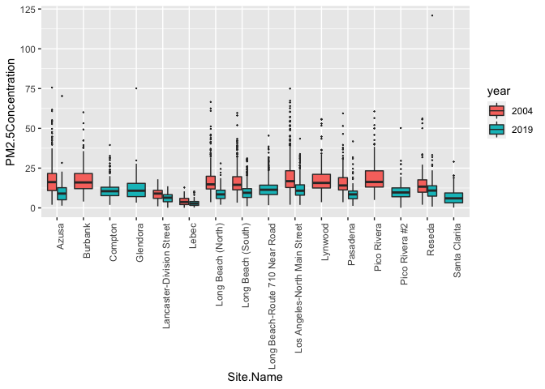

Assignment 01: Exploratory Data Analysis
================
Flemming Wu
2022-09-10

#### We will work with air pollution data from the U.S. Environmental Protection Agency (EPA). The primary question you will answer is whether daily concentrations of PM 2.5 (particulate matter air pollution with aerodynamic diameter less than 2.5 m) have decreased in California over the last 15 years (from 2004 to 2019).

``` r
library(tidyverse)
library(leaflet)
library(webshot)
```

##### 1. Read in the data using data.table(). For each of the two datasets, check the dimensions, headers, footers, variable names, and variable types. Check for any data issues, particularly in the key variable you are analyzing. Make sure you write up a summary of all of your findings.

``` r
if (!file.exists("data_2004.csv")) {
    download.file("https://raw.githubusercontent.com/flemm0/PM_566/main/01-assignment/data_2004.csv",
        destfile = "data_2004.csv", method = "libcurl", timeout = 60)
}

if (!file.exists("data_2019.csv")) {
    download.file("https://raw.githubusercontent.com/flemm0/PM_566/main/01-assignment/data_2019.csv",
        destfile = "data_2019.csv", method = "libcurl", timeout = 60)
}

data_2004 <- data.table::fread("data_2004.csv")
data_2019 <- data.table::fread("data_2019.csv")
```

``` r
noquote(c("2004 dimensions: ", dim(data_2004)))
```

    ## [1] 2004 dimensions:  19233             20

``` r
noquote(c("2019 dimensions: ", dim(data_2019)))
```

    ## [1] 2019 dimensions:  53156             20

``` r
dim(data_2019)[1]/dim(data_2004)[1]
```

    ## [1] 2.763791

There are almost 3 times as many observations for PM 2.5 concentration
in 2019 compared to 2004.

``` r
head(data_2004)
```

    ##          Date Source  Site ID POC Daily Mean PM2.5 Concentration    UNITS
    ## 1: 01/01/2004    AQS 60010007   1                            8.9 ug/m3 LC
    ## 2: 01/02/2004    AQS 60010007   1                           12.2 ug/m3 LC
    ## 3: 01/03/2004    AQS 60010007   1                           16.5 ug/m3 LC
    ## 4: 01/04/2004    AQS 60010007   1                           18.1 ug/m3 LC
    ## 5: 01/05/2004    AQS 60010007   1                           11.5 ug/m3 LC
    ## 6: 01/06/2004    AQS 60010007   1                           32.5 ug/m3 LC
    ##    DAILY_AQI_VALUE Site Name DAILY_OBS_COUNT PERCENT_COMPLETE
    ## 1:              37 Livermore               1              100
    ## 2:              51 Livermore               1              100
    ## 3:              60 Livermore               1              100
    ## 4:              64 Livermore               1              100
    ## 5:              48 Livermore               1              100
    ## 6:              94 Livermore               1              100
    ##    AQS_PARAMETER_CODE                     AQS_PARAMETER_DESC CBSA_CODE
    ## 1:              88101               PM2.5 - Local Conditions     41860
    ## 2:              88502 Acceptable PM2.5 AQI & Speciation Mass     41860
    ## 3:              88502 Acceptable PM2.5 AQI & Speciation Mass     41860
    ## 4:              88101               PM2.5 - Local Conditions     41860
    ## 5:              88502 Acceptable PM2.5 AQI & Speciation Mass     41860
    ## 6:              88502 Acceptable PM2.5 AQI & Speciation Mass     41860
    ##                            CBSA_NAME STATE_CODE      STATE COUNTY_CODE  COUNTY
    ## 1: San Francisco-Oakland-Hayward, CA          6 California           1 Alameda
    ## 2: San Francisco-Oakland-Hayward, CA          6 California           1 Alameda
    ## 3: San Francisco-Oakland-Hayward, CA          6 California           1 Alameda
    ## 4: San Francisco-Oakland-Hayward, CA          6 California           1 Alameda
    ## 5: San Francisco-Oakland-Hayward, CA          6 California           1 Alameda
    ## 6: San Francisco-Oakland-Hayward, CA          6 California           1 Alameda
    ##    SITE_LATITUDE SITE_LONGITUDE
    ## 1:      37.68753      -121.7842
    ## 2:      37.68753      -121.7842
    ## 3:      37.68753      -121.7842
    ## 4:      37.68753      -121.7842
    ## 5:      37.68753      -121.7842
    ## 6:      37.68753      -121.7842

``` r
tail(data_2004)
```

    ##          Date Source  Site ID POC Daily Mean PM2.5 Concentration    UNITS
    ## 1: 12/14/2004    AQS 61131003   1                             11 ug/m3 LC
    ## 2: 12/17/2004    AQS 61131003   1                             16 ug/m3 LC
    ## 3: 12/20/2004    AQS 61131003   1                             17 ug/m3 LC
    ## 4: 12/23/2004    AQS 61131003   1                              9 ug/m3 LC
    ## 5: 12/26/2004    AQS 61131003   1                             24 ug/m3 LC
    ## 6: 12/29/2004    AQS 61131003   1                              9 ug/m3 LC
    ##    DAILY_AQI_VALUE            Site Name DAILY_OBS_COUNT PERCENT_COMPLETE
    ## 1:              46 Woodland-Gibson Road               1              100
    ## 2:              59 Woodland-Gibson Road               1              100
    ## 3:              61 Woodland-Gibson Road               1              100
    ## 4:              38 Woodland-Gibson Road               1              100
    ## 5:              76 Woodland-Gibson Road               1              100
    ## 6:              38 Woodland-Gibson Road               1              100
    ##    AQS_PARAMETER_CODE       AQS_PARAMETER_DESC CBSA_CODE
    ## 1:              88101 PM2.5 - Local Conditions     40900
    ## 2:              88101 PM2.5 - Local Conditions     40900
    ## 3:              88101 PM2.5 - Local Conditions     40900
    ## 4:              88101 PM2.5 - Local Conditions     40900
    ## 5:              88101 PM2.5 - Local Conditions     40900
    ## 6:              88101 PM2.5 - Local Conditions     40900
    ##                                  CBSA_NAME STATE_CODE      STATE COUNTY_CODE
    ## 1: Sacramento--Roseville--Arden-Arcade, CA          6 California         113
    ## 2: Sacramento--Roseville--Arden-Arcade, CA          6 California         113
    ## 3: Sacramento--Roseville--Arden-Arcade, CA          6 California         113
    ## 4: Sacramento--Roseville--Arden-Arcade, CA          6 California         113
    ## 5: Sacramento--Roseville--Arden-Arcade, CA          6 California         113
    ## 6: Sacramento--Roseville--Arden-Arcade, CA          6 California         113
    ##    COUNTY SITE_LATITUDE SITE_LONGITUDE
    ## 1:   Yolo      38.66121      -121.7327
    ## 2:   Yolo      38.66121      -121.7327
    ## 3:   Yolo      38.66121      -121.7327
    ## 4:   Yolo      38.66121      -121.7327
    ## 5:   Yolo      38.66121      -121.7327
    ## 6:   Yolo      38.66121      -121.7327

``` r
head(data_2019)
```

    ##          Date Source  Site ID POC Daily Mean PM2.5 Concentration    UNITS
    ## 1: 01/01/2019    AQS 60010007   3                            5.7 ug/m3 LC
    ## 2: 01/02/2019    AQS 60010007   3                           11.9 ug/m3 LC
    ## 3: 01/03/2019    AQS 60010007   3                           20.1 ug/m3 LC
    ## 4: 01/04/2019    AQS 60010007   3                           28.8 ug/m3 LC
    ## 5: 01/05/2019    AQS 60010007   3                           11.2 ug/m3 LC
    ## 6: 01/06/2019    AQS 60010007   3                            2.7 ug/m3 LC
    ##    DAILY_AQI_VALUE Site Name DAILY_OBS_COUNT PERCENT_COMPLETE
    ## 1:              24 Livermore               1              100
    ## 2:              50 Livermore               1              100
    ## 3:              68 Livermore               1              100
    ## 4:              86 Livermore               1              100
    ## 5:              47 Livermore               1              100
    ## 6:              11 Livermore               1              100
    ##    AQS_PARAMETER_CODE       AQS_PARAMETER_DESC CBSA_CODE
    ## 1:              88101 PM2.5 - Local Conditions     41860
    ## 2:              88101 PM2.5 - Local Conditions     41860
    ## 3:              88101 PM2.5 - Local Conditions     41860
    ## 4:              88101 PM2.5 - Local Conditions     41860
    ## 5:              88101 PM2.5 - Local Conditions     41860
    ## 6:              88101 PM2.5 - Local Conditions     41860
    ##                            CBSA_NAME STATE_CODE      STATE COUNTY_CODE  COUNTY
    ## 1: San Francisco-Oakland-Hayward, CA          6 California           1 Alameda
    ## 2: San Francisco-Oakland-Hayward, CA          6 California           1 Alameda
    ## 3: San Francisco-Oakland-Hayward, CA          6 California           1 Alameda
    ## 4: San Francisco-Oakland-Hayward, CA          6 California           1 Alameda
    ## 5: San Francisco-Oakland-Hayward, CA          6 California           1 Alameda
    ## 6: San Francisco-Oakland-Hayward, CA          6 California           1 Alameda
    ##    SITE_LATITUDE SITE_LONGITUDE
    ## 1:      37.68753      -121.7842
    ## 2:      37.68753      -121.7842
    ## 3:      37.68753      -121.7842
    ## 4:      37.68753      -121.7842
    ## 5:      37.68753      -121.7842
    ## 6:      37.68753      -121.7842

``` r
tail(data_2019)
```

    ##          Date Source  Site ID POC Daily Mean PM2.5 Concentration    UNITS
    ## 1: 11/11/2019    AQS 61131003   1                           13.5 ug/m3 LC
    ## 2: 11/17/2019    AQS 61131003   1                           18.1 ug/m3 LC
    ## 3: 11/29/2019    AQS 61131003   1                           12.5 ug/m3 LC
    ## 4: 12/17/2019    AQS 61131003   1                           23.8 ug/m3 LC
    ## 5: 12/23/2019    AQS 61131003   1                            1.0 ug/m3 LC
    ## 6: 12/29/2019    AQS 61131003   1                            9.1 ug/m3 LC
    ##    DAILY_AQI_VALUE            Site Name DAILY_OBS_COUNT PERCENT_COMPLETE
    ## 1:              54 Woodland-Gibson Road               1              100
    ## 2:              64 Woodland-Gibson Road               1              100
    ## 3:              52 Woodland-Gibson Road               1              100
    ## 4:              76 Woodland-Gibson Road               1              100
    ## 5:               4 Woodland-Gibson Road               1              100
    ## 6:              38 Woodland-Gibson Road               1              100
    ##    AQS_PARAMETER_CODE       AQS_PARAMETER_DESC CBSA_CODE
    ## 1:              88101 PM2.5 - Local Conditions     40900
    ## 2:              88101 PM2.5 - Local Conditions     40900
    ## 3:              88101 PM2.5 - Local Conditions     40900
    ## 4:              88101 PM2.5 - Local Conditions     40900
    ## 5:              88101 PM2.5 - Local Conditions     40900
    ## 6:              88101 PM2.5 - Local Conditions     40900
    ##                                  CBSA_NAME STATE_CODE      STATE COUNTY_CODE
    ## 1: Sacramento--Roseville--Arden-Arcade, CA          6 California         113
    ## 2: Sacramento--Roseville--Arden-Arcade, CA          6 California         113
    ## 3: Sacramento--Roseville--Arden-Arcade, CA          6 California         113
    ## 4: Sacramento--Roseville--Arden-Arcade, CA          6 California         113
    ## 5: Sacramento--Roseville--Arden-Arcade, CA          6 California         113
    ## 6: Sacramento--Roseville--Arden-Arcade, CA          6 California         113
    ##    COUNTY SITE_LATITUDE SITE_LONGITUDE
    ## 1:   Yolo      38.66121      -121.7327
    ## 2:   Yolo      38.66121      -121.7327
    ## 3:   Yolo      38.66121      -121.7327
    ## 4:   Yolo      38.66121      -121.7327
    ## 5:   Yolo      38.66121      -121.7327
    ## 6:   Yolo      38.66121      -121.7327

``` r
str(data_2004)
```

    ## Classes 'data.table' and 'data.frame':   19233 obs. of  20 variables:
    ##  $ Date                          : chr  "01/01/2004" "01/02/2004" "01/03/2004" "01/04/2004" ...
    ##  $ Source                        : chr  "AQS" "AQS" "AQS" "AQS" ...
    ##  $ Site ID                       : int  60010007 60010007 60010007 60010007 60010007 60010007 60010007 60010007 60010007 60010007 ...
    ##  $ POC                           : int  1 1 1 1 1 1 1 1 1 1 ...
    ##  $ Daily Mean PM2.5 Concentration: num  8.9 12.2 16.5 18.1 11.5 32.5 14 29.9 21 15.7 ...
    ##  $ UNITS                         : chr  "ug/m3 LC" "ug/m3 LC" "ug/m3 LC" "ug/m3 LC" ...
    ##  $ DAILY_AQI_VALUE               : int  37 51 60 64 48 94 55 88 70 59 ...
    ##  $ Site Name                     : chr  "Livermore" "Livermore" "Livermore" "Livermore" ...
    ##  $ DAILY_OBS_COUNT               : int  1 1 1 1 1 1 1 1 1 1 ...
    ##  $ PERCENT_COMPLETE              : num  100 100 100 100 100 100 100 100 100 100 ...
    ##  $ AQS_PARAMETER_CODE            : int  88101 88502 88502 88101 88502 88502 88101 88502 88502 88101 ...
    ##  $ AQS_PARAMETER_DESC            : chr  "PM2.5 - Local Conditions" "Acceptable PM2.5 AQI & Speciation Mass" "Acceptable PM2.5 AQI & Speciation Mass" "PM2.5 - Local Conditions" ...
    ##  $ CBSA_CODE                     : int  41860 41860 41860 41860 41860 41860 41860 41860 41860 41860 ...
    ##  $ CBSA_NAME                     : chr  "San Francisco-Oakland-Hayward, CA" "San Francisco-Oakland-Hayward, CA" "San Francisco-Oakland-Hayward, CA" "San Francisco-Oakland-Hayward, CA" ...
    ##  $ STATE_CODE                    : int  6 6 6 6 6 6 6 6 6 6 ...
    ##  $ STATE                         : chr  "California" "California" "California" "California" ...
    ##  $ COUNTY_CODE                   : int  1 1 1 1 1 1 1 1 1 1 ...
    ##  $ COUNTY                        : chr  "Alameda" "Alameda" "Alameda" "Alameda" ...
    ##  $ SITE_LATITUDE                 : num  37.7 37.7 37.7 37.7 37.7 ...
    ##  $ SITE_LONGITUDE                : num  -122 -122 -122 -122 -122 ...
    ##  - attr(*, ".internal.selfref")=<externalptr>

``` r
str(data_2019)
```

    ## Classes 'data.table' and 'data.frame':   53156 obs. of  20 variables:
    ##  $ Date                          : chr  "01/01/2019" "01/02/2019" "01/03/2019" "01/04/2019" ...
    ##  $ Source                        : chr  "AQS" "AQS" "AQS" "AQS" ...
    ##  $ Site ID                       : int  60010007 60010007 60010007 60010007 60010007 60010007 60010007 60010007 60010007 60010007 ...
    ##  $ POC                           : int  3 3 3 3 3 3 3 3 3 3 ...
    ##  $ Daily Mean PM2.5 Concentration: num  5.7 11.9 20.1 28.8 11.2 2.7 2.8 7 3.1 7.1 ...
    ##  $ UNITS                         : chr  "ug/m3 LC" "ug/m3 LC" "ug/m3 LC" "ug/m3 LC" ...
    ##  $ DAILY_AQI_VALUE               : int  24 50 68 86 47 11 12 29 13 30 ...
    ##  $ Site Name                     : chr  "Livermore" "Livermore" "Livermore" "Livermore" ...
    ##  $ DAILY_OBS_COUNT               : int  1 1 1 1 1 1 1 1 1 1 ...
    ##  $ PERCENT_COMPLETE              : num  100 100 100 100 100 100 100 100 100 100 ...
    ##  $ AQS_PARAMETER_CODE            : int  88101 88101 88101 88101 88101 88101 88101 88101 88101 88101 ...
    ##  $ AQS_PARAMETER_DESC            : chr  "PM2.5 - Local Conditions" "PM2.5 - Local Conditions" "PM2.5 - Local Conditions" "PM2.5 - Local Conditions" ...
    ##  $ CBSA_CODE                     : int  41860 41860 41860 41860 41860 41860 41860 41860 41860 41860 ...
    ##  $ CBSA_NAME                     : chr  "San Francisco-Oakland-Hayward, CA" "San Francisco-Oakland-Hayward, CA" "San Francisco-Oakland-Hayward, CA" "San Francisco-Oakland-Hayward, CA" ...
    ##  $ STATE_CODE                    : int  6 6 6 6 6 6 6 6 6 6 ...
    ##  $ STATE                         : chr  "California" "California" "California" "California" ...
    ##  $ COUNTY_CODE                   : int  1 1 1 1 1 1 1 1 1 1 ...
    ##  $ COUNTY                        : chr  "Alameda" "Alameda" "Alameda" "Alameda" ...
    ##  $ SITE_LATITUDE                 : num  37.7 37.7 37.7 37.7 37.7 ...
    ##  $ SITE_LONGITUDE                : num  -122 -122 -122 -122 -122 ...
    ##  - attr(*, ".internal.selfref")=<externalptr>

It looks like some of the column names are separated by space, so will
update them to be syntactically valid.

``` r
names(data_2004) <- make.names(names(data_2004))
names(data_2019) <- make.names(names(data_2019))
```

Checking Key Variable: PM 2.5 Concentration

``` r
summary(data_2004$Daily.Mean.PM2.5.Concentration)
```

    ##    Min. 1st Qu.  Median    Mean 3rd Qu.    Max. 
    ##   -0.10    6.00   10.10   13.13   16.30  251.00

Looks like some observations are below 0.

``` r
table(data_2004$Daily.Mean.PM2.5.Concentration) %>%
    head()
```

    ## 
    ## -0.1    0  0.1  0.2  0.3  0.4 
    ##    1   11   15   20   27   32

One observation for PM 2.5 concentration is negative.

``` r
quantile(data_2004$Daily.Mean.PM2.5.Concentration, seq(0, 1,
    0.1))
```

    ##    0%   10%   20%   30%   40%   50%   60%   70%   80%   90%  100% 
    ##  -0.1   3.7   5.3   7.0   8.5  10.1  12.0  14.7  18.6  27.0 251.0

Looks like 10% of the data lie between concentration levels of 27 and
251.

``` r
summary(data_2019$Daily.Mean.PM2.5.Concentration)
```

    ##    Min. 1st Qu.  Median    Mean 3rd Qu.    Max. 
    ##   -2.20    4.00    6.50    7.74    9.90  120.90

``` r
table(data_2019$Daily.Mean.PM2.5.Concentration) %>%
    head()
```

    ## 
    ## -2.2   -2 -1.9 -1.8 -1.7 -1.6 
    ##    1   12   16   11   12   12

Looks like 2019 has many more 2.5 concentration observations that are
below 0.

``` r
quantile(data_2019$Daily.Mean.PM2.5.Concentration, seq(0, 1,
    0.1))
```

    ##    0%   10%   20%   30%   40%   50%   60%   70%   80%   90%  100% 
    ##  -2.2   2.3   3.5   4.5   5.5   6.5   7.7   9.1  10.9  14.2 120.9

10% of the data lie between concentration levels of 14.2 and 120.9.
Additionally, the maximum 2.5 concentration observation is less than
half that of the 2004 data. This is plausible due to increase of effort
to reduce air pollution levels.

The EPA standard for PM 2.5 concentration post-1997 is 65 ug/m3 and was
lowered to 35 ug/m3 since 2006.

The negative PM 2.5 concentration levels pose a problem for answering
the question and will be removed.

##### 2. Combine the two years of data into one data frame. Use the Date variable to create a new column for year, which will serve as an identifier. Change the names of the key variables so that they are easier to refer to in your code.

``` r
data_2004 <- mutate(data_2004, Date = as.Date(Date, "%m/%d/%Y"))
data_2004$year <- format(as.Date(data_2004$Date, format = "%m/%d/%Y"),
    "%Y")


data_2019 <- mutate(data_2019, Date = as.Date(Date, "%m/%d/%Y"))
data_2019$year <- format(as.Date(data_2019$Date, format = "%m/%d/%Y"),
    "%Y")
```

``` r
df_all <- rbind(data_2004, data_2019)

names(df_all) <- make.names(names(df_all))
names(df_all)[names(df_all) == "Daily.Mean.PM2.5.Concentration"] <- "PM2.5Concentration"

df_all <- df_all[order(df_all$PM2.5Concentration)]  #Ascending order by PM 2.5
```

##### 3. Create a basic map in leaflet() that shows the locations of the sites (make sure to use different colors for each year). Summarize the spatial distribution of the monitoring sites.

``` r
pal <- colorFactor(palette = c("red", "blue"), domain = df_all$year)

leaflet(df_all) %>%
    addProviderTiles("OpenStreetMap") %>%
    addCircles(lat = ~SITE_LATITUDE, lng = ~SITE_LONGITUDE, color = ~pal(year)) %>%
    addLegend(pal = pal, values = ~year)
```

<!-- -->

##### 4. Check for any missing or implausible values of PM 2.5 in the combined dataset. Explore the proportions of each and provide a summary of any temporal patterns you see in these observations.

``` r
sum(as.numeric(is.na(df_all$PM2.5Concentration)))
```

    ## [1] 0

No missing values

``` r
summary(df_all$PM2.5Concentration)
```

    ##    Min. 1st Qu.  Median    Mean 3rd Qu.    Max. 
    ##  -2.200   4.400   7.200   9.171  11.300 251.000

``` r
df_all %>%
    filter(PM2.5Concentration < 0) %>%
    group_by(Site.Name, year) %>%
    summarise(negative_readings = n()) %>%
    arrange(desc(negative_readings))
```

    ## # A tibble: 41 × 3
    ## # Groups:   Site.Name [41]
    ##    Site.Name                            year  negative_readings
    ##    <chr>                                <chr>             <int>
    ##  1 Tahoe City-Fairway Drive             2019                153
    ##  2 Lake Elsinore                        2019                 30
    ##  3 Lompoc H Street                      2019                 12
    ##  4 Arroyo Grande CDF                    2019                  9
    ##  5 Piru - Pacific                       2019                  5
    ##  6 Ridgecrest-Ward                      2019                  5
    ##  7 Salinas 3                            2019                  5
    ##  8 Lebec                                2019                  4
    ##  9 Red Bluff-Walnut St. District Office 2019                  4
    ## 10 Table Mountain Air Monitoring Site   2019                  4
    ## # … with 31 more rows

``` r
noquote(c(sum(with(df_all, PM2.5Concentration < 0 & year == "2019"))/nrow(filter(df_all,
    year == "2019")) * 100, "percent of 2019 data is negative"))
```

    ## [1] 0.530513958913387                percent of 2019 data is negative

``` r
noquote(c(sum(with(df_all, PM2.5Concentration < 0 & year == "2004"))/nrow(filter(df_all,
    year == "2004")) * 100, "percent of 2004 data is negative"))
```

    ## [1] 0.00519939686996308              percent of 2004 data is negative

For measurements of **concentration** of particulate matter in the air,
it seems implausible to have a negative observations. Remove from the
data.

``` r
df_all <- df_all %>%
    filter(PM2.5Concentration > 0)
```

``` r
ggplot(data = filter(df_all, year == "2004")) + geom_jitter(mapping = aes(x = Date,
    y = PM2.5Concentration)) + geom_smooth(mapping = aes(x = Date,
    y = PM2.5Concentration))
```

    ## `geom_smooth()` using method = 'gam' and formula 'y ~ s(x, bs = "cs")'

<!-- -->

``` r
ggplot(data = filter(df_all, year == "2019")) + geom_jitter(mapping = aes(x = Date,
    y = PM2.5Concentration)) + geom_smooth(mapping = aes(x = Date,
    y = PM2.5Concentration))
```

    ## `geom_smooth()` using method = 'gam' and formula 'y ~ s(x, bs = "cs")'

<!-- -->

##### 5. Explore the main question of interest at three different spatial levels. Create exploratory plots (e.g. boxplots, histograms, line plots) and summary statistics that best suit each level of data. Be sure to write up explanations of what you observe in these data.

``` r
# Plot 2004 daata
par(mfrow = c(2, 1), mar = c(2, 4, 2, 1))
hist(subset(df_all, year == "2004")$PM2.5Concentration, col = "red",
    breaks = 200, main = "2004 PM 2.5 Concentration", xlab = "PM 2.5")
abline(v = 65, lwd = 2)
abline(v = median(subset(df_all, year == "2004")$PM2.5Concentration),
    lwd = 2, col = "purple")

# Plot 2019 data
hist(subset(df_all, year == "2019")$PM2.5Concentration, col = "light blue",
    breaks = 200, main = "2019 PM 2.5 Concentration", xlab = "PM 2.5",
    xlim = c(0, 250))
abline(v = 35, lwd = 2)
abline(v = median(subset(df_all, year == "2019")$PM2.5Concentration),
    lwd = 2, col = "purple")
```

<!-- -->

``` r
ggplot(df_all, mapping = aes(x = COUNTY, y = PM2.5Concentration,
    color = year)) + geom_jitter() + theme(axis.text.x = element_text(angle = 90,
    vjust = 0.5, hjust = 1))
```

<!-- -->

``` r
county_averages <- df_all %>%
    group_by(COUNTY, year) %>%
    summarise_at(vars(PM2.5Concentration), list(Mean_PM2.5 = median))


ggplot(county_averages) + geom_point(mapping = aes(x = COUNTY,
    y = Mean_PM2.5, color = year)) + theme(axis.text.x = element_text(angle = 90,
    vjust = 0.5, hjust = 1))
```

<!-- -->

``` r
# Change to bar plot to better represent categorical x-axis
# variable. Make a box plots per county.
```

Look at sites in Los Angeles County.

``` r
filter(df_all, COUNTY == "Los Angeles") %>%
    select(Site.Name) %>%
    unique() %>%
    arrange(Site.Name)
```

    ##                          Site.Name
    ##  1:                               
    ##  2:                          Azusa
    ##  3:                        Burbank
    ##  4:                        Compton
    ##  5:                       Glendora
    ##  6:      Lancaster-Division Street
    ##  7:                          Lebec
    ##  8:             Long Beach (North)
    ##  9:             Long Beach (South)
    ## 10: Long Beach-Route 710 Near Road
    ## 11:  Los Angeles-North Main Street
    ## 12:                        Lynwood
    ## 13:                       Pasadena
    ## 14:                 Pico Rivera #2
    ## 15:                         Reseda
    ## 16:                  Santa Clarita

``` r
filter(df_all, COUNTY == "Los Angeles" & Site.Name == "") %>%
    select(Site.Name, SITE_LATITUDE, SITE_LONGITUDE) %>%
    unique()
```

    ##    Site.Name SITE_LATITUDE SITE_LONGITUDE
    ## 1:                34.01407      -118.0606

``` r
# One of the sites is missing a name

# From looking at Google Maps and matching the latitude and
# longitude, it seems as though the coordinates 34.01407,
# -118.0606 are close to the Pico Rivera #2 site, leading
# me to suspect that the unnamed site is Pico Rivera #1.

# I validated this by checking the AQS website for a
# monitoring station at this location.
# https://epa.maps.arcgis.com/apps/webappviewer/index.html?id=5f239fd3e72f424f98ef3d5def547eb5&extent=-146.2334,13.1913,-46.3896,56.5319
# The monitor is inactive now, but was active in 2004.
# Additionally, it wasn't given a site name, but the
# website says the city is 'Pico Rivera'. Will update this
# information in the data set to accurately reflect the
# site location.
```

``` r
df_la <- filter(df_all, COUNTY == "Los Angeles")
df_la$Site.Name <- replace(df_la$Site.Name, df_la$Site.Name ==
    "", "Pico Rivera")
```

``` r
ggplot(data = df_la, mapping = aes(x = Site.Name, y = PM2.5Concentration,
    fill = year)) + geom_boxplot(outlier.size = 0.1) + theme(axis.text.x = element_text(angle = 90,
    vjust = 1, hjust = 1))
```

<!-- -->
