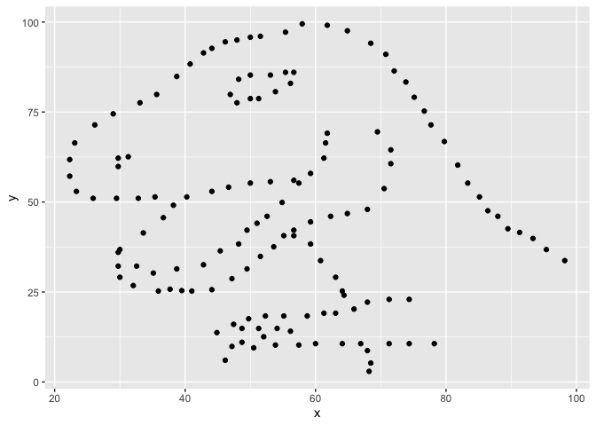
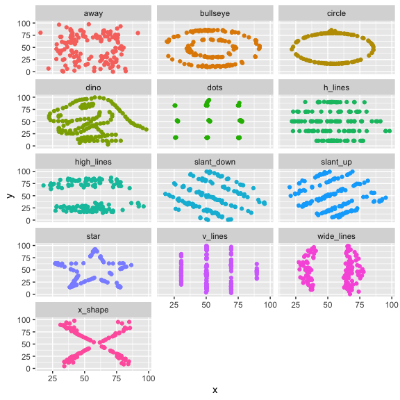

Lab 01: Hello R
================
Flemming Wu
8/24/2022

``` r
#need to load the libraries in the md file (not console) for knitr to work
library(tidyverse)
```

    ## ── Attaching packages ─────────────────────────────────────── tidyverse 1.3.2 ──
    ## ✔ ggplot2 3.3.6     ✔ purrr   0.3.4
    ## ✔ tibble  3.1.8     ✔ dplyr   1.0.9
    ## ✔ tidyr   1.2.0     ✔ stringr 1.4.0
    ## ✔ readr   2.1.2     ✔ forcats 0.5.2
    ## ── Conflicts ────────────────────────────────────────── tidyverse_conflicts() ──
    ## ✖ dplyr::filter() masks stats::filter()
    ## ✖ dplyr::lag()    masks stats::lag()

``` r
library(datasauRus)
```

## Exercise 1

How many rows and columns are in the dataset datasaurus_dozen?

``` r
dim(datasaurus_dozen)
```

    ## [1] 1846    3

1846 rows, and 3 columns

What are the variables included in the data frame?

``` r
datasaurus_dozen
```

    ## # A tibble: 1,846 × 3
    ##    dataset     x     y
    ##    <chr>   <dbl> <dbl>
    ##  1 dino     55.4  97.2
    ##  2 dino     51.5  96.0
    ##  3 dino     46.2  94.5
    ##  4 dino     42.8  91.4
    ##  5 dino     40.8  88.3
    ##  6 dino     38.7  84.9
    ##  7 dino     35.6  79.9
    ##  8 dino     33.1  77.6
    ##  9 dino     29.0  74.5
    ## 10 dino     26.2  71.4
    ## # … with 1,836 more rows

name of dataset (character), x (double), y (double)

``` r
datasaurus_dozen %>%
  count(dataset)
```

    ## # A tibble: 13 × 2
    ##    dataset        n
    ##    <chr>      <int>
    ##  1 away         142
    ##  2 bullseye     142
    ##  3 circle       142
    ##  4 dino         142
    ##  5 dots         142
    ##  6 h_lines      142
    ##  7 high_lines   142
    ##  8 slant_down   142
    ##  9 slant_up     142
    ## 10 star         142
    ## 11 v_lines      142
    ## 12 wide_lines   142
    ## 13 x_shape      142

142 entries for each of the datasets

## Exercise 2

Plot y vs x for the dino dataset. Then, calculate the correlation
coefficient between x and y for this dataset.

``` r
dino_data <- datasaurus_dozen %>%
  filter(dataset == "dino")

ggplot(data = dino_data, mapping = aes(x = x, y = y)) +
  geom_point()
```

<!-- -->

``` r
dino_data %>%
  summarize(r = cor(x, y))
```

    ## # A tibble: 1 × 1
    ##         r
    ##     <dbl>
    ## 1 -0.0645

## Exercise 3

Plot y vs x for the star dataset.

``` r
star_data <- datasaurus_dozen %>%
  filter(dataset == "star")

ggplot(data = star_data, mapping = aes(x = x, y = y)) +
  geom_point()
```

<!-- -->

``` r
star_data %>%
  summarize(r = cor(x, y))
```

    ## # A tibble: 1 × 1
    ##         r
    ##     <dbl>
    ## 1 -0.0630

Very similar correlation coefficient with the dino dataset

## Exercise 4

Plot y vs x for the circle dataset.

``` r
circle_data <- datasaurus_dozen %>%
  filter(dataset == "circle")

ggplot(data = circle_data, mapping = aes(x = x, y = y)) +
  geom_point()
```

<!-- -->

``` r
circle_data %>%
  summarize(r = cor(x, y))
```

    ## # A tibble: 1 × 1
    ##         r
    ##     <dbl>
    ## 1 -0.0683

Also has a similar correlation coefficient to those of the star and dino
datasets

## Exercise 5

Put all dataset figures in 1 plot

``` r
ggplot(datasaurus_dozen, aes(x = x, y = y, color = dataset))+
  geom_point()+
  facet_wrap(~ dataset, ncol = 3) +
  theme(legend.position = "none")
```

<!-- -->

``` r
datasaurus_dozen %>%
  group_by(dataset) %>%
  summarize(r = cor(x, y))
```

    ## # A tibble: 13 × 2
    ##    dataset          r
    ##    <chr>        <dbl>
    ##  1 away       -0.0641
    ##  2 bullseye   -0.0686
    ##  3 circle     -0.0683
    ##  4 dino       -0.0645
    ##  5 dots       -0.0603
    ##  6 h_lines    -0.0617
    ##  7 high_lines -0.0685
    ##  8 slant_down -0.0690
    ##  9 slant_up   -0.0686
    ## 10 star       -0.0630
    ## 11 v_lines    -0.0694
    ## 12 wide_lines -0.0666
    ## 13 x_shape    -0.0656

``` r
sessionInfo()
```

    ## R version 4.0.5 (2021-03-31)
    ## Platform: x86_64-apple-darwin17.0 (64-bit)
    ## Running under: macOS Big Sur 10.16
    ## 
    ## Matrix products: default
    ## BLAS:   /Library/Frameworks/R.framework/Versions/4.0/Resources/lib/libRblas.dylib
    ## LAPACK: /Library/Frameworks/R.framework/Versions/4.0/Resources/lib/libRlapack.dylib
    ## 
    ## locale:
    ## [1] en_US.UTF-8/en_US.UTF-8/en_US.UTF-8/C/en_US.UTF-8/en_US.UTF-8
    ## 
    ## attached base packages:
    ## [1] stats     graphics  grDevices utils     datasets  methods   base     
    ## 
    ## other attached packages:
    ##  [1] datasauRus_0.1.6 forcats_0.5.2    stringr_1.4.0    dplyr_1.0.9     
    ##  [5] purrr_0.3.4      readr_2.1.2      tidyr_1.2.0      tibble_3.1.8    
    ##  [9] ggplot2_3.3.6    tidyverse_1.3.2 
    ## 
    ## loaded via a namespace (and not attached):
    ##  [1] tidyselect_1.1.1    xfun_0.31           haven_2.5.1        
    ##  [4] gargle_1.2.0        colorspace_2.0-3    vctrs_0.4.1        
    ##  [7] generics_0.1.0      htmltools_0.5.2     yaml_2.3.5         
    ## [10] utf8_1.2.2          rlang_1.0.2         pillar_1.8.1       
    ## [13] withr_2.5.0         glue_1.6.2          DBI_1.1.3          
    ## [16] dbplyr_2.2.1        modelr_0.1.9        readxl_1.4.1       
    ## [19] lifecycle_1.0.1     munsell_0.5.0       gtable_0.3.0       
    ## [22] cellranger_1.1.0    rvest_1.0.3         evaluate_0.15      
    ## [25] labeling_0.4.2      knitr_1.39          tzdb_0.3.0         
    ## [28] fastmap_1.1.0       fansi_0.5.0         highr_0.9          
    ## [31] broom_1.0.0         scales_1.2.1        backports_1.4.1    
    ## [34] googlesheets4_1.0.1 jsonlite_1.8.0      farver_2.1.1       
    ## [37] fs_1.5.2            hms_1.1.2           digest_0.6.29      
    ## [40] stringi_1.7.6       grid_4.0.5          cli_3.3.0          
    ## [43] tools_4.0.5         magrittr_2.0.1      crayon_1.5.1       
    ## [46] pkgconfig_2.0.3     ellipsis_0.3.2      xml2_1.3.3         
    ## [49] reprex_2.0.2        googledrive_2.0.0   lubridate_1.8.0    
    ## [52] assertthat_0.2.1    rmarkdown_2.15      httr_1.4.4         
    ## [55] rstudioapi_0.13     R6_2.5.1            compiler_4.0.5
