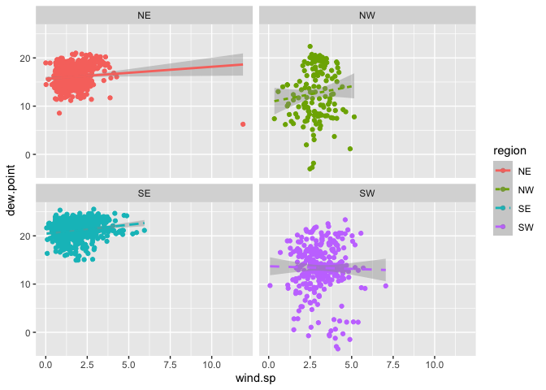
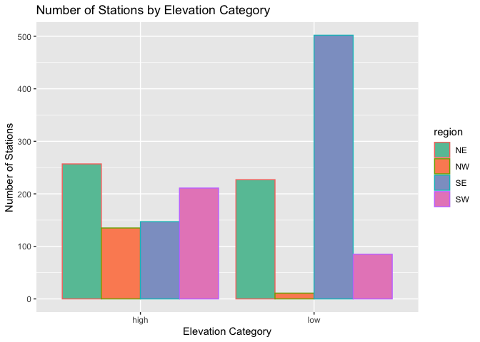
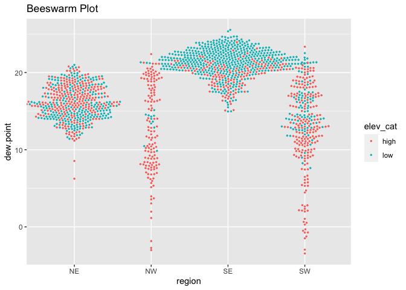

04-lab-Data-Visualization
================
Flemming Wu
2022-09-14

### 1. Read in the data

``` r
if(!file.exists("met_all.gz")){
  download.file(
    url = "https://raw.githubusercontent.com/USCbiostats/data-science-data/master/02_met/met_all.gz",
    destfile = "met_all.gz",
    method = "libcurl",
    timeout = 60
  )
}

met <- data.table::fread("met_all.gz")
```

``` r
library(tidyverse)
library(data.table)
```

### 2. Preparing the data

``` r
dim(met)
```

    ## [1] 2377343      30

``` r
summary(met$elev)
```

    ##    Min. 1st Qu.  Median    Mean 3rd Qu.    Max. 
    ##   -13.0   101.0   252.0   415.8   400.0  9999.0

``` r
summary(met$temp)
```

    ##    Min. 1st Qu.  Median    Mean 3rd Qu.    Max.    NA's 
    ##  -40.00   19.60   23.50   23.59   27.80   56.00   60089

``` r
met <- met[met$temp > -17][elev == 9999.0, elev := NA]
```

``` r
met$date = paste(met$year, met$month, met$day, sep = "-")
met <- mutate(met, date = as.Date(date, "%Y-%m-%d"))
```

``` r
met$week <- data.table::week(met$date)
```

``` r
met <- met[met$week == min(met$week)]
```

``` r
met_avg <- met[,.(
  temp     = mean(temp,na.rm=TRUE),
  rh       = mean(rh,na.rm=TRUE),
  wind.sp  = mean(wind.sp,na.rm=TRUE),
  vis.dist = mean(vis.dist,na.rm=TRUE),
  dew.point = mean(dew.point,na.rm=TRUE),
  lat      = mean(lat),
  lon      = mean(lon), 
  elev     = mean(elev,na.rm=TRUE)
), by="USAFID"]
```

``` r
met_avg[, region := fifelse(lon > -98 & lat > 39.71, "NE", 
                fifelse(lon < -98 & lat > 39.71, "NW",
                fifelse(lon < -98 & lat <= 39.71, "SW", "SE")))
                ]

table(met_avg$region)
```

    ## 
    ##  NE  NW  SE  SW 
    ## 484 146 649 296

``` r
met_avg[, elev_cat := fifelse(elev > 252, "high", "low")]
```

### 3. Use geom_violin() to examine the wind speed and dew point temperature by region

Use facets Make sure to deal with NA category Describe what you observe
in the graph

``` r
met_avg[!is.na(region)] %>%
  ggplot() +
  geom_violin(mapping = aes(x = 1, y = dew.point, color = region, fill = region)) +
  facet_wrap(~ region, nrow = 1)
```

<!-- --> The
highest dew point temperature is recorded in the southeast.

``` r
met_avg[!is.na(region) & !is.na(wind.sp)] %>%
  ggplot() +
  geom_violin(aes(x =  1, y = wind.sp, color = region, fill = region)) +
  facet_wrap(~ region, nrow = 1)
```

<!-- -->
The highest wind speed was recorded in the northeast.

### 4. Use geom_jitter with geom_smooth to examine the association between dew point temperature and wind speed by region

Colour points by region Make sure to deal with NA category Fit a linear
regression line by region Describe what you observe in the graph

``` r
met_avg[!is.na(region) & !is.na(wind.sp)] %>%
  ggplot(mapping = aes(x = wind.sp, y = dew.point, color = region)) +
  geom_point(mapping = aes(color = region)) +
  geom_smooth(method = lm, mapping = aes(linetype = region)) +
  facet_wrap(~ region, nrow = 2)
```

    ## `geom_smooth()` using formula 'y ~ x'

<!-- --> It appears
that the southwest region is the only region that sees a decrease in
dewpoint with increasing wind speed.

### 5. Use geom_bar to create barplots of the weather stations by elevation category coloured by region

Bars by elevation category using position=“dodge” Change colours from
the default. Colour by region using scale_fill_brewer see this Create
nice labels on axes and add a title Describe what you observe in the
graph Make sure to deal with NA

``` r
met_avg[!is.na(elev_cat)] %>%
  ggplot() +
  geom_bar(mapping = aes(x = elev_cat, col = region))
```

<!-- -->

### 6. Use stat_summary to examine mean dew point and wind speed by region with standard deviation error bars

Make sure to remove NA Use fun.data=“mean_sdl” in stat_summary Add
another layer of stats_summary but change the geom to “errorbar” (see
the help). Describe the graph and what you observe Dew point temperature
is… Wind speed is…

``` r
met_avg[!is.na(dew.point)] %>%
  ggplot(mapping = aes(x=region, y=dew.point)) +
  stat_summary(fun.data = "mean_sdl", geom = "errorbar")
```

<!-- --> The west
seems to have lower dew points on average

### 7. Make a map showing the spatial trend in relative h in the US

Make sure to remove NA Use leaflet() Make a colour palette with custom
colours Use addMarkers to include the top 10 places in relative h (hint:
this will be useful rank(-rh) \<= 10) Add a legend Describe trend in RH
across the US

``` r
top10rh <- met_avg[rank(-rh) <= 10]

top10rh
```

    ##     USAFID     temp       rh   wind.sp  vis.dist dew.point      lat        lon
    ##  1: 720379 21.47634 91.98783 3.3273256  9565.011  19.90323 36.85500  -84.85600
    ##  2: 720624 21.17226 94.86840 3.6029279 16031.801  20.20582 44.01600  -97.08600
    ##  3: 720646 14.61373 96.14343 2.7878193  4305.788  13.97451 37.51300 -122.50100
    ##  4: 722038 26.88414 92.79511 2.8909722 13964.862  25.52966 26.15496  -81.77500
    ##  5: 723930 12.94467 94.48180 2.0378173  5185.784  11.97908 34.71700 -120.56600
    ##  6: 724737 25.86219 92.24941 0.6226148 13076.251  24.31095 28.81700  -82.31700
    ##  7: 725495 21.66667 92.04836 2.4371560 15551.776  20.14222 43.20800  -95.83300
    ##  8: 725513 21.61979 92.70759 3.1020833 13254.417  20.22639 40.89300  -97.99700
    ##  9: 725946 15.79515 92.65354 2.2703883  8310.199  14.55388 41.78000 -124.23601
    ## 10: 726530 22.88160 97.40711 2.4968750 12453.917  22.38889 43.76700  -99.31801
    ##           elev region elev_cat
    ##  1: 294.000000     SE     high
    ##  2: 523.000000     NE     high
    ##  3:  20.000000     SW      low
    ##  4:   6.896552     SE      low
    ##  5: 112.000000     SW      low
    ##  6:  15.000000     SE      low
    ##  7: 433.000000     NE     high
    ##  8: 550.000000     NE     high
    ##  9:  17.000000     NW      low
    ## 10: 517.000000     NW     high

``` r
library(leaflet)
library(webshot)


rh.pal <- colorNumeric(c('darkgreen','goldenrod','brown'), domain=met_avg$rh)
rh.pal
```

    ## function (x) 
    ## {
    ##     if (length(x) == 0 || all(is.na(x))) {
    ##         return(pf(x))
    ##     }
    ##     if (is.null(rng)) 
    ##         rng <- range(x, na.rm = TRUE)
    ##     rescaled <- scales::rescale(x, from = rng)
    ##     if (any(rescaled < 0 | rescaled > 1, na.rm = TRUE)) 
    ##         warning("Some values were outside the color scale and will be treated as NA")
    ##     if (reverse) {
    ##         rescaled <- 1 - rescaled
    ##     }
    ##     pf(rescaled)
    ## }
    ## <bytecode: 0x7fbd485355b8>
    ## <environment: 0x7fbd48537eb0>
    ## attr(,"colorType")
    ## [1] "numeric"
    ## attr(,"colorArgs")
    ## attr(,"colorArgs")$na.color
    ## [1] "#808080"

``` r
rhmap <- leaflet(met_avg) %>% 
  # The looks of the Map
  addProviderTiles('CartoDB.Positron') %>% 
  # Some circles
  addCircles(
    lat = ~lat, lng=~lon,
    label = ~paste0(rh), color = ~ rh.pal(rh),
    opacity = 1, fillOpacity = 1, radius = 500
    ) %>%
  # And a pretty legend
  addLegend('bottomleft', pal=rh.pal, values=met_avg$rh,
          title='Relative Humidity', opacity=1)

rhmap
```

<!-- -->
