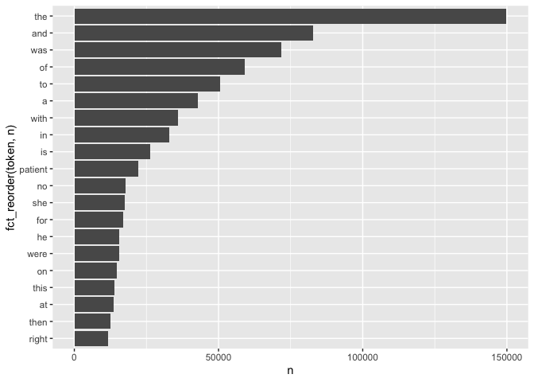

06-Lab Text Mining
================
Flemming Wu
2022-09-28

# Learning goals

-   Use `unnest_tokens()` and `unnest_ngrams()` to extract tokens and
    ngrams from text.
-   Use dplyr and ggplot2 to analyze text data

# Lab description

For this lab we will be working with a new dataset. The dataset contains
transcription samples from <https://www.mtsamples.com/>. And is loaded
and “fairly” cleaned at
<https://raw.githubusercontent.com/USCbiostats/data-science-data/master/00_mtsamples/mtsamples.csv>.

This markdown document should be rendered using `github_document`
document.

### Setup packages

You should load in `dplyr`, (or `data.table` if you want to work that
way), `ggplot2` and `tidytext`.

``` r
library(tidyverse)
library(tidytext)
library(knitr)
library(forcats)
```

### read in Medical Transcriptions

Loading in reference transcription samples from
<https://www.mtsamples.com/>

``` r
if(!file.exists("mtsamples.csv")){
  download.file(url = "https://raw.githubusercontent.com/USCbiostats/data-science-data/master/00_mtsamples/mtsamples.csv",
                destfile = "mtsamples.csv",
                method = "libcurl",
                timeout = 60)
}

mtsamples <- read.csv("mtsamples.csv")

#str(mtsamples) 

#change to tibble format
mtsamples <- as.tibble(mtsamples)

str(mtsamples)
```

    ## tibble [4,999 × 6] (S3: tbl_df/tbl/data.frame)
    ##  $ X                : int [1:4999] 0 1 2 3 4 5 6 7 8 9 ...
    ##  $ description      : chr [1:4999] " A 23-year-old white female presents with complaint of allergies." " Consult for laparoscopic gastric bypass." " Consult for laparoscopic gastric bypass." " 2-D M-Mode. Doppler.  " ...
    ##  $ medical_specialty: chr [1:4999] " Allergy / Immunology" " Bariatrics" " Bariatrics" " Cardiovascular / Pulmonary" ...
    ##  $ sample_name      : chr [1:4999] " Allergic Rhinitis " " Laparoscopic Gastric Bypass Consult - 2 " " Laparoscopic Gastric Bypass Consult - 1 " " 2-D Echocardiogram - 1 " ...
    ##  $ transcription    : chr [1:4999] "SUBJECTIVE:,  This 23-year-old white female presents with complaint of allergies.  She used to have allergies w"| __truncated__ "PAST MEDICAL HISTORY:, He has difficulty climbing stairs, difficulty with airline seats, tying shoes, used to p"| __truncated__ "HISTORY OF PRESENT ILLNESS: , I have seen ABC today.  He is a very pleasant gentleman who is 42 years old, 344 "| __truncated__ "2-D M-MODE: , ,1.  Left atrial enlargement with left atrial diameter of 4.7 cm.,2.  Normal size right and left "| __truncated__ ...
    ##  $ keywords         : chr [1:4999] "allergy / immunology, allergic rhinitis, allergies, asthma, nasal sprays, rhinitis, nasal, erythematous, allegr"| __truncated__ "bariatrics, laparoscopic gastric bypass, weight loss programs, gastric bypass, atkin's diet, weight watcher's, "| __truncated__ "bariatrics, laparoscopic gastric bypass, heart attacks, body weight, pulmonary embolism, potential complication"| __truncated__ "cardiovascular / pulmonary, 2-d m-mode, doppler, aortic valve, atrial enlargement, diastolic function, ejection"| __truncated__ ...

------------------------------------------------------------------------

## Question 1: What specialties do we have?

We can use `count()` from `dplyr` to figure out how many different
categories do we have? Are these catagories related? overlapping? evenly
distributed?

``` r
specialties <- mtsamples %>%
  count(medical_specialty, sort = TRUE)

knitr::kable(specialties)
```

| medical_specialty             |    n |
|:------------------------------|-----:|
| Surgery                       | 1103 |
| Consult - History and Phy.    |  516 |
| Cardiovascular / Pulmonary    |  372 |
| Orthopedic                    |  355 |
| Radiology                     |  273 |
| General Medicine              |  259 |
| Gastroenterology              |  230 |
| Neurology                     |  223 |
| SOAP / Chart / Progress Notes |  166 |
| Obstetrics / Gynecology       |  160 |
| Urology                       |  158 |
| Discharge Summary             |  108 |
| ENT - Otolaryngology          |   98 |
| Neurosurgery                  |   94 |
| Hematology - Oncology         |   90 |
| Ophthalmology                 |   83 |
| Nephrology                    |   81 |
| Emergency Room Reports        |   75 |
| Pediatrics - Neonatal         |   70 |
| Pain Management               |   62 |
| Psychiatry / Psychology       |   53 |
| Office Notes                  |   51 |
| Podiatry                      |   47 |
| Dermatology                   |   29 |
| Cosmetic / Plastic Surgery    |   27 |
| Dentistry                     |   27 |
| Letters                       |   23 |
| Physical Medicine - Rehab     |   21 |
| Sleep Medicine                |   20 |
| Endocrinology                 |   19 |
| Bariatrics                    |   18 |
| IME-QME-Work Comp etc.        |   16 |
| Chiropractic                  |   14 |
| Diets and Nutritions          |   10 |
| Rheumatology                  |   10 |
| Speech - Language             |    9 |
| Autopsy                       |    8 |
| Lab Medicine - Pathology      |    8 |
| Allergy / Immunology          |    7 |
| Hospice - Palliative Care     |    6 |

There are 40 medical specialties.

``` r
specialties %>%
  top_n(10) %>%
  ggplot(aes(x = n, y = fct_reorder(medical_specialty, n))) +
  geom_col()
```

    ## Selecting by n

<!-- -->  
The distribution is not uniform among all of the categories. Even within
the top 10 categories, the distrubution is very uneven. The largest
category of medical specialty is surgery.

------------------------------------------------------------------------

## Question 2

-   Tokenize the the words in the `transcription` column
-   Count the number of times each token appears
-   Visualize the top 20 most frequent words

Explain what we see from this result. Does it makes sense? What insights
(if any) do we get?

``` r
mtsamples %>%
  unnest_tokens(token, transcription) %>%
  count(token) %>%
  top_n(20, n) %>%
  ggplot(aes(x = n, y = fct_reorder(token, n))) +
  geom_col()
```

<!-- -->  
The results do make sense, with common stop words such as “the”, “and”,
“was”, “of”, etc. showing up in the majority of the top 20 tokens in the
transcription column. Additionally, the high frequency of the word
“patient” is expected.

------------------------------------------------------------------------

## Question 3

-   Redo visualization but remove stopwords before
-   Bonus points if you remove numbers as well

What do we see know that we have removed stop words? Does it give us a
better idea of what the text is about?

``` r
mtsamples %>%
  unnest_tokens(token, transcription) %>%
  count(token, sort = TRUE) %>%
  anti_join(stop_words, by = c("token" = "word")) %>%
  filter( !grepl(pattern = "^[0-9]+$", x = token)) %>% #regex step to remove numbers
  top_n(20, n) %>%
  ggplot(aes(x = n, y = fct_reorder(token, n))) +
  geom_col()
```

<!-- -->  
With the stop words removed, we are now left with words that are
associated with medical terminology such as “procedure”, “pain”,
“blood”, “anesthesia”, “disease”, etc. It is now clear to anyone looking
at the column chart that the text being visualized is medical-related.

------------------------------------------------------------------------

# Question 4

repeat question 2, but this time tokenize into bi-grams. how does the
result change if you look at tri-grams?

``` r
mtsamples %>%
  unnest_ngrams(bigram, transcription, n = 2) %>%
  count(bigram, sort = TRUE) %>%
  top_n(20, n) %>%
  ggplot(aes(x = n, y = fct_reorder(bigram, n))) +
  geom_col()
```

<!-- -->

``` r
mtsamples %>%
  unnest_ngrams(trigram, transcription, n = 3) %>%
  count(trigram, sort = TRUE) %>%
  top_n(20, n) %>%
  ggplot(aes(x = n, y = fct_reorder(trigram, n))) +
  geom_col()
```

<!-- -->  
Trigrams seemed to turn up a few more medical word groups than bigrams.

------------------------------------------------------------------------

# Question 5

Using the results you got from questions 4. Pick a word and count the
words that appears after and before it.

``` r
mtsamples %>%
  unnest_ngrams(bigram, transcription, n = 2) %>%
  separate(bigram, into = c("word1", "word2"), sep = " ") %>%
  select(word1, word2) %>%
  anti_join(stop_words, by = c("word2" = "word")) %>%
  filter(word1 == "blood") %>%
  count(word2, sort = TRUE)
```

    ## # A tibble: 119 × 2
    ##    word2           n
    ##    <chr>       <int>
    ##  1 pressure     1265
    ##  2 loss          965
    ##  3 cell          130
    ##  4 cells         112
    ##  5 sugar          91
    ##  6 sugars         79
    ##  7 cultures       53
    ##  8 flow           45
    ##  9 transfusion    42
    ## 10 glucose        37
    ## # … with 109 more rows

``` r
mtsamples %>%
  unnest_ngrams(bigram, transcription, n = 2) %>%
  separate(bigram, into = c("word1", "word2"), sep = " ") %>%
  select(word1, word2) %>%
  anti_join(stop_words, by = c("word1" = "word")) %>%
  filter(word2 == "blood") %>%
  count(word1, sort = TRUE)
```

    ## # A tibble: 361 × 2
    ##    word1         n
    ##    <chr>     <int>
    ##  1 estimated   754
    ##  2 white       180
    ##  3 signs       170
    ##  4 red         123
    ##  5 pounds       48
    ##  6 cold         29
    ##  7 18           28
    ##  8 cord         28
    ##  9 fasting      28
    ## 10 elevated     27
    ## # … with 351 more rows

------------------------------------------------------------------------

# Question 6

Which words are most used in each of the specialties. you can use
`group_by()` and `top_n()` from `dplyr` to have the calculations be done
within each specialty. Remember to remove stopwords. How about the most
5 used words?

``` r
mtsamples %>%
  unnest_tokens(token, transcription) %>%
  anti_join(stop_words, by = c("token" = "word")) %>%
  filter( !grepl(pattern = "^[0-9]+$", x = token)) %>%
  select(medical_specialty, token) %>%
  group_by(medical_specialty) %>%
  count(token, sort = TRUE) %>%
  top_n(5, n) %>%
  arrange(medical_specialty) %>%
  knitr::kable()
```

| medical_specialty             | token        |    n |
|:------------------------------|:-------------|-----:|
| Allergy / Immunology          | history      |   38 |
| Allergy / Immunology          | noted        |   23 |
| Allergy / Immunology          | patient      |   22 |
| Allergy / Immunology          | allergies    |   21 |
| Allergy / Immunology          | nasal        |   13 |
| Allergy / Immunology          | past         |   13 |
| Autopsy                       | left         |   83 |
| Autopsy                       | inch         |   59 |
| Autopsy                       | neck         |   55 |
| Autopsy                       | anterior     |   47 |
| Autopsy                       | body         |   40 |
| Bariatrics                    | patient      |   62 |
| Bariatrics                    | history      |   50 |
| Bariatrics                    | weight       |   36 |
| Bariatrics                    | surgery      |   34 |
| Bariatrics                    | gastric      |   30 |
| Cardiovascular / Pulmonary    | left         | 1550 |
| Cardiovascular / Pulmonary    | patient      | 1516 |
| Cardiovascular / Pulmonary    | artery       | 1085 |
| Cardiovascular / Pulmonary    | coronary     |  681 |
| Cardiovascular / Pulmonary    | history      |  654 |
| Chiropractic                  | pain         |  187 |
| Chiropractic                  | patient      |   85 |
| Chiropractic                  | dr           |   66 |
| Chiropractic                  | history      |   56 |
| Chiropractic                  | left         |   54 |
| Consult - History and Phy.    | patient      | 3046 |
| Consult - History and Phy.    | history      | 2820 |
| Consult - History and Phy.    | normal       | 1368 |
| Consult - History and Phy.    | pain         | 1153 |
| Consult - History and Phy.    | mg           |  908 |
| Cosmetic / Plastic Surgery    | patient      |  116 |
| Cosmetic / Plastic Surgery    | procedure    |   98 |
| Cosmetic / Plastic Surgery    | breast       |   95 |
| Cosmetic / Plastic Surgery    | skin         |   88 |
| Cosmetic / Plastic Surgery    | incision     |   67 |
| Dentistry                     | patient      |  195 |
| Dentistry                     | tooth        |  108 |
| Dentistry                     | teeth        |  104 |
| Dentistry                     | left         |   94 |
| Dentistry                     | procedure    |   82 |
| Dermatology                   | patient      |  101 |
| Dermatology                   | skin         |  101 |
| Dermatology                   | cm           |   77 |
| Dermatology                   | left         |   58 |
| Dermatology                   | procedure    |   44 |
| Diets and Nutritions          | patient      |   43 |
| Diets and Nutritions          | weight       |   40 |
| Diets and Nutritions          | carbohydrate |   37 |
| Diets and Nutritions          | day          |   28 |
| Diets and Nutritions          | food         |   27 |
| Diets and Nutritions          | plan         |   27 |
| Discharge Summary             | patient      |  672 |
| Discharge Summary             | discharge    |  358 |
| Discharge Summary             | mg           |  301 |
| Discharge Summary             | history      |  208 |
| Discharge Summary             | hospital     |  183 |
| Emergency Room Reports        | patient      |  685 |
| Emergency Room Reports        | history      |  356 |
| Emergency Room Reports        | pain         |  273 |
| Emergency Room Reports        | normal       |  255 |
| Emergency Room Reports        | denies       |  149 |
| Endocrinology                 | thyroid      |  129 |
| Endocrinology                 | patient      |  121 |
| Endocrinology                 | left         |   63 |
| Endocrinology                 | history      |   57 |
| Endocrinology                 | dissection   |   45 |
| Endocrinology                 | gland        |   45 |
| Endocrinology                 | nerve        |   45 |
| ENT - Otolaryngology          | patient      |  415 |
| ENT - Otolaryngology          | nasal        |  281 |
| ENT - Otolaryngology          | left         |  219 |
| ENT - Otolaryngology          | ear          |  182 |
| ENT - Otolaryngology          | procedure    |  181 |
| Gastroenterology              | patient      |  872 |
| Gastroenterology              | procedure    |  470 |
| Gastroenterology              | history      |  341 |
| Gastroenterology              | normal       |  328 |
| Gastroenterology              | colon        |  240 |
| General Medicine              | patient      | 1356 |
| General Medicine              | history      | 1027 |
| General Medicine              | normal       |  717 |
| General Medicine              | pain         |  567 |
| General Medicine              | mg           |  503 |
| Hematology - Oncology         | patient      |  316 |
| Hematology - Oncology         | history      |  290 |
| Hematology - Oncology         | left         |  187 |
| Hematology - Oncology         | mg           |  107 |
| Hematology - Oncology         | mass         |   97 |
| Hospice - Palliative Care     | patient      |   43 |
| Hospice - Palliative Care     | mg           |   28 |
| Hospice - Palliative Care     | history      |   27 |
| Hospice - Palliative Care     | daughter     |   22 |
| Hospice - Palliative Care     | family       |   19 |
| Hospice - Palliative Care     | pain         |   19 |
| IME-QME-Work Comp etc.        | pain         |  152 |
| IME-QME-Work Comp etc.        | patient      |  106 |
| IME-QME-Work Comp etc.        | dr           |   82 |
| IME-QME-Work Comp etc.        | injury       |   81 |
| IME-QME-Work Comp etc.        | left         |   70 |
| Lab Medicine - Pathology      | cm           |   35 |
| Lab Medicine - Pathology      | tumor        |   35 |
| Lab Medicine - Pathology      | lymph        |   30 |
| Lab Medicine - Pathology      | lobe         |   29 |
| Lab Medicine - Pathology      | upper        |   20 |
| Letters                       | pain         |   80 |
| Letters                       | abc          |   71 |
| Letters                       | patient      |   65 |
| Letters                       | normal       |   53 |
| Letters                       | dr           |   46 |
| Nephrology                    | patient      |  348 |
| Nephrology                    | renal        |  257 |
| Nephrology                    | history      |  160 |
| Nephrology                    | kidney       |  144 |
| Nephrology                    | left         |  132 |
| Neurology                     | left         |  672 |
| Neurology                     | patient      |  648 |
| Neurology                     | normal       |  485 |
| Neurology                     | history      |  429 |
| Neurology                     | time         |  278 |
| Neurosurgery                  | patient      |  374 |
| Neurosurgery                  | c5           |  289 |
| Neurosurgery                  | c6           |  266 |
| Neurosurgery                  | procedure    |  247 |
| Neurosurgery                  | left         |  222 |
| Obstetrics / Gynecology       | patient      |  628 |
| Obstetrics / Gynecology       | uterus       |  317 |
| Obstetrics / Gynecology       | procedure    |  301 |
| Obstetrics / Gynecology       | incision     |  293 |
| Obstetrics / Gynecology       | normal       |  276 |
| Office Notes                  | normal       |  230 |
| Office Notes                  | negative     |  193 |
| Office Notes                  | patient      |   94 |
| Office Notes                  | history      |   76 |
| Office Notes                  | noted        |   60 |
| Ophthalmology                 | eye          |  456 |
| Ophthalmology                 | patient      |  258 |
| Ophthalmology                 | procedure    |  176 |
| Ophthalmology                 | anterior     |  150 |
| Ophthalmology                 | chamber      |  149 |
| Orthopedic                    | patient      | 1711 |
| Orthopedic                    | left         |  998 |
| Orthopedic                    | pain         |  763 |
| Orthopedic                    | procedure    |  669 |
| Orthopedic                    | lateral      |  472 |
| Pain Management               | patient      |  236 |
| Pain Management               | procedure    |  197 |
| Pain Management               | needle       |  156 |
| Pain Management               | injected     |   76 |
| Pain Management               | pain         |   76 |
| Pediatrics - Neonatal         | patient      |  247 |
| Pediatrics - Neonatal         | history      |  235 |
| Pediatrics - Neonatal         | normal       |  155 |
| Pediatrics - Neonatal         | child        |   82 |
| Pediatrics - Neonatal         | mom          |   82 |
| Physical Medicine - Rehab     | patient      |  220 |
| Physical Medicine - Rehab     | left         |  104 |
| Physical Medicine - Rehab     | pain         |   95 |
| Physical Medicine - Rehab     | motor        |   62 |
| Physical Medicine - Rehab     | history      |   54 |
| Podiatry                      | foot         |  232 |
| Podiatry                      | patient      |  231 |
| Podiatry                      | left         |  137 |
| Podiatry                      | tendon       |   98 |
| Podiatry                      | incision     |   96 |
| Psychiatry / Psychology       | patient      |  532 |
| Psychiatry / Psychology       | history      |  344 |
| Psychiatry / Psychology       | mg           |  183 |
| Psychiatry / Psychology       | mother       |  164 |
| Psychiatry / Psychology       | reported     |  141 |
| Radiology                     | left         |  701 |
| Radiology                     | normal       |  644 |
| Radiology                     | patient      |  304 |
| Radiology                     | exam         |  302 |
| Radiology                     | mild         |  242 |
| Rheumatology                  | history      |   50 |
| Rheumatology                  | patient      |   34 |
| Rheumatology                  | mg           |   26 |
| Rheumatology                  | pain         |   23 |
| Rheumatology                  | day          |   22 |
| Rheumatology                  | examination  |   22 |
| Rheumatology                  | joints       |   22 |
| Sleep Medicine                | sleep        |  143 |
| Sleep Medicine                | patient      |   69 |
| Sleep Medicine                | apnea        |   35 |
| Sleep Medicine                | activity     |   31 |
| Sleep Medicine                | stage        |   29 |
| SOAP / Chart / Progress Notes | patient      |  537 |
| SOAP / Chart / Progress Notes | mg           |  302 |
| SOAP / Chart / Progress Notes | history      |  254 |
| SOAP / Chart / Progress Notes | pain         |  239 |
| SOAP / Chart / Progress Notes | blood        |  194 |
| Speech - Language             | patient      |  105 |
| Speech - Language             | therapy      |   41 |
| Speech - Language             | speech       |   35 |
| Speech - Language             | patient’s    |   28 |
| Speech - Language             | evaluation   |   17 |
| Speech - Language             | goals        |   17 |
| Speech - Language             | term         |   17 |
| Speech - Language             | time         |   17 |
| Surgery                       | patient      | 4855 |
| Surgery                       | left         | 3263 |
| Surgery                       | procedure    | 3243 |
| Surgery                       | anesthesia   | 1687 |
| Surgery                       | incision     | 1641 |
| Urology                       | patient      |  776 |
| Urology                       | bladder      |  357 |
| Urology                       | procedure    |  306 |
| Urology                       | left         |  288 |
| Urology                       | history      |  196 |

# Question 7 - extra

Find your own insight in the data:

Ideas:

-   Interesting ngrams
-   See if certain words are used more in some specialties then others
